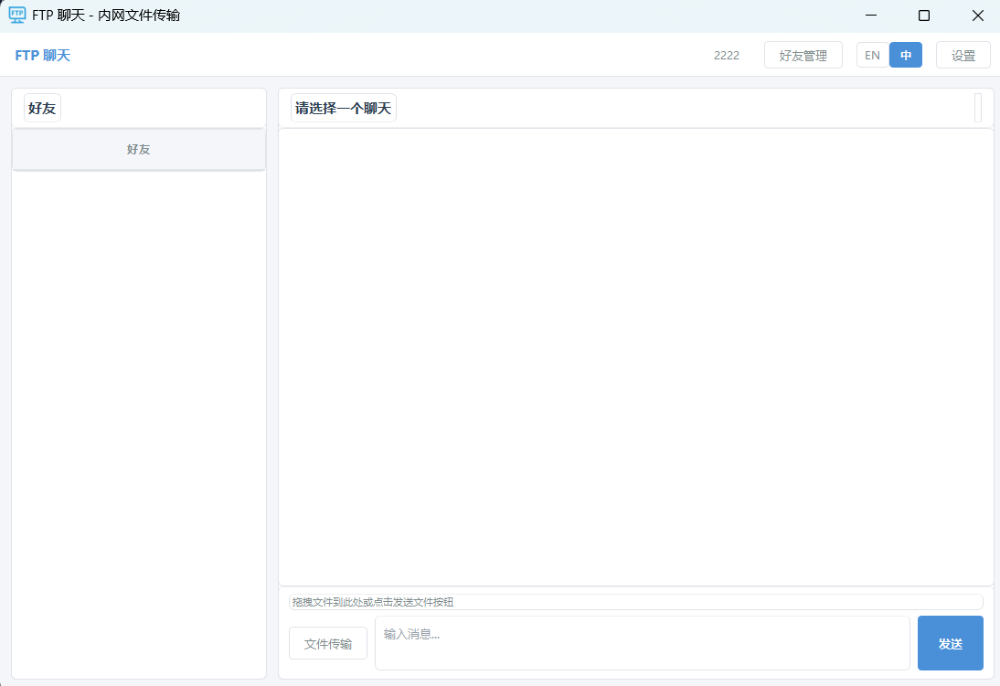
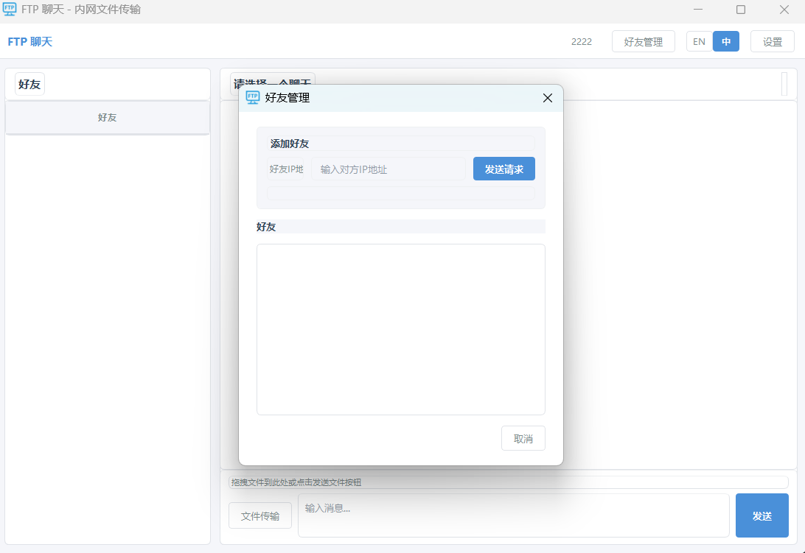
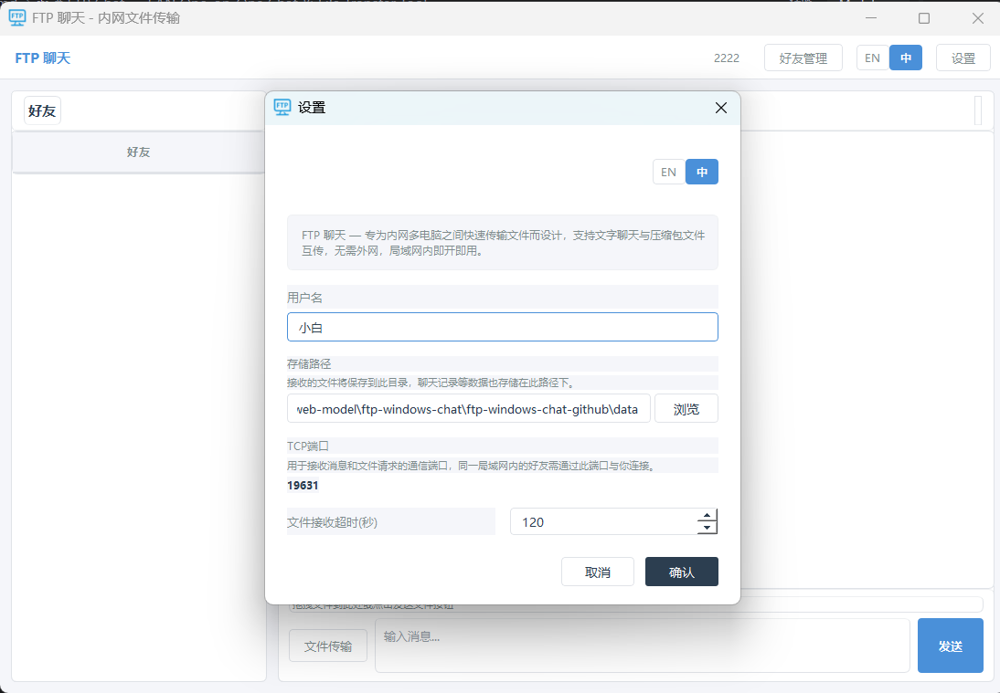

# FTP 聊天 — 内网一对一聊天与文件传输工具

<p align="center">
  <strong>专为内网多电脑之间快速传输文件而设计</strong><br>
  支持一对一文字聊天与文件互传，无需外网，局域网内即开即用
</p>

---

## 功能特性

- **一对一聊天** — 好友私聊，消息本地持久化存储，支持消息送达状态反馈
- **文件传输** — 基于 FTP 协议的文件传输，支持大文件、进度显示、实时速度
- **好友管理** — 通过 IP 地址添加同局域网内的好友，实时检测在线状态，删除好友时通知对方
- **未读消息** — 非当前聊天好友收到消息时显示未读数量提示
- **多语言** — 支持中文 / English 切换
- **零依赖外网** — 纯局域网通信，无需互联网连接

## 软件截图

### 好友聊天



### 好友管理



### 设置



## 技术栈

| 模块 | 技术 |
|------|------|
| GUI 框架 | PyQt5 |
| 消息通信 | TCP Socket (自定义协议) |
| 文件传输 | FTP (pyftpdlib) |
| 数据存储 | JSON 文件 |
| 语言 | Python 3.12 |

## 项目结构

```
ftp-windows-chat-github/
├── main.py                       # 程序入口，初始化应用并启动主窗口
├── build.py                      # 打包脚本，使用 PyInstaller 生成 EXE
├── requirements.txt              # 依赖列表
├── config/
│   ├── settings.py               # 全局配置（端口、路径、超时等）
│   ├── theme.py                  # UI 主题样式（颜色、字体、按钮风格）
│   └── i18n/                     # 国际化翻译
│       ├── __init__.py           # 翻译函数 t()，支持动态切换语言
│       ├── zh_cn.py              # 中文翻译字典
│       └── en_us.py              # 英文翻译字典
├── core/
│   ├── network.py                # TCP 服务端/客户端，在线检测与状态缓存
│   ├── chat_manager.py           # 聊天消息管理，消息收发与事件分发
│   ├── file_manager.py           # 文件传输管理，发送/接收生命周期控制
│   ├── ftp_server.py             # FTP 临时服务器，每次传输独立实例
│   └── ftp_client.py             # FTP 下载客户端，进度回调与速度计算
├── models/
│   ├── friend.py                 # 好友模型，增删改查与持久化
│   ├── message.py                # 消息模型，文字/文件消息与送达状态
│   └── file_transfer.py          # 文件传输记录模型，状态跟踪
├── ui/
│   ├── main_window.py            # 主窗口，事件分发与心跳检测
│   ├── chat_widget.py            # 聊天区域，消息显示与输入发送
│   ├── friend_list.py            # 好友列表组件
│   ├── friend_manager_dialog.py  # 好友管理对话框（添加/删除）
│   ├── add_friend_dialog.py      # 添加好友对话框
│   ├── settings_dialog.py        # 设置对话框
│   └── components/
│       ├── message_bubble.py     # 消息气泡组件（文字/文件样式）
│       ├── file_receive_dialog.py# 文件接收确认对话框（倒计时）
│       └── language_switch.py    # 语言切换组件
├── utils/
│   ├── helpers.py                # 工具函数（格式化、自动重命名等）
│   └── logger.py                 # 日志模块
└── data/                         # 运行时数据（自动生成）
    ├── config.json               # 用户配置
    ├── friends.json              # 好友列表
    ├── transfers.json            # 文件传输记录
    ├── messages/                 # 聊天消息（按好友分文件存储）
    ├── files/                    # 接收的文件
    └── logs/                     # 日志文件
```

## 快速开始

### 环境要求

- Python 3.12
- Conda (推荐) 或 pip
- Windows 操作系统

### 创建 Conda 环境

```bash
conda create -n ftp-chat python=3.12
conda activate ftp-chat
```

### 安装依赖

```bash
pip install -r requirements.txt
```

### 启动应用

```bash
python main.py
```

首次启动会弹出设置窗口，请填写用户名后即可使用。

### 打包为 EXE

```bash
python build.py
```

打包完成后，可执行文件位于 `dist/FTPChat/FTPChat.exe`。

## 使用说明

### 1. 添加好友

点击右上角「好友管理」按钮，输入好友名称和 IP 地址即可发送好友请求。对方确认后双方互为好友。对方需在同一局域网内，且 TCP 端口（默认 19631）可访问。

### 2. 发送消息

在左侧好友列表中选择一个好友，在底部输入框输入文字，点击「发送」按钮或按 **Enter** 键发送。按 **Shift+Enter** 可换行。

### 3. 传输文件

- 点击「文件传输」按钮或拖拽文件到输入区域
- 对方会收到文件接收请求弹窗，可选择接收或拒绝
- 传输过程中显示进度条和实时速度
- 超时未操作自动拒绝，发送方状态同步更新
- 接收的文件自动保存到设置的存储路径，同名文件自动重命名

### 4. 删除好友

在好友管理中右键删除好友时，会通知对方。对方可选择同步删除或保留标记。

### 5. 设置

- **用户名**：显示给其他用户的名称
- **存储路径**：接收文件的保存目录
- **TCP 端口**：用于接收消息和文件请求的通信端口（默认 19631），同一局域网内的好友需通过此端口与你连接
- **文件接收超时**：文件传输请求的自动超时时间（默认 120 秒）

## 通信原理

```
发送消息:
  发送方 → TCP Socket → 接收方:19631 → 解析并显示

传输文件:
  1. 发送方启动临时 FTP 服务器 (随机端口)
  2. 发送方通过 TCP 通知接收方 (文件名、大小、FTP端口)
  3. 接收方确认后，通过 FTP 协议下载文件
  4. 下载完成后通知发送方，临时 FTP 服务器关闭

在线检测:
  心跳定时器每 30 秒强制 TCP 连接检测所有好友在线状态
  发送消息时自动更新缓存，避免重复检测
```

## 依赖

- [PyQt5](https://pypi.org/project/PyQt5/) >= 5.15.0 — GUI 框架
- [pyftpdlib](https://pypi.org/project/pyftpdlib/) >= 1.5.9 — FTP 服务器

## 更多IT学习资源

更多IT学习资源 https://www.wwwoop.com

## 许可证

MIT License
