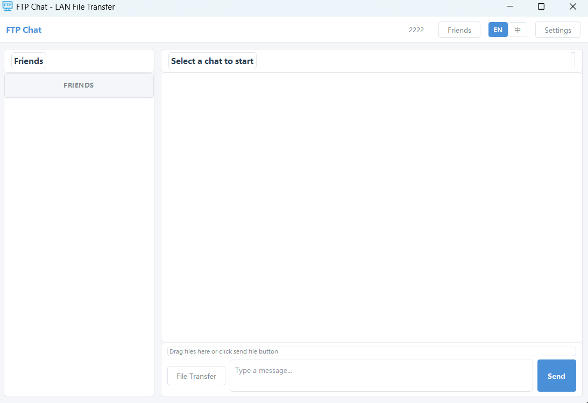
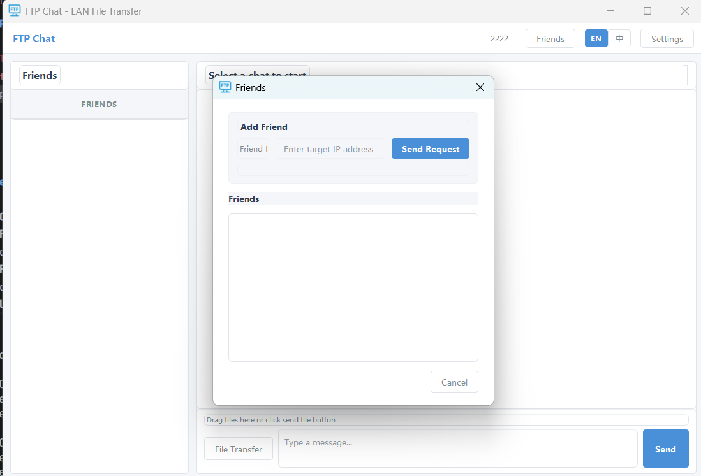
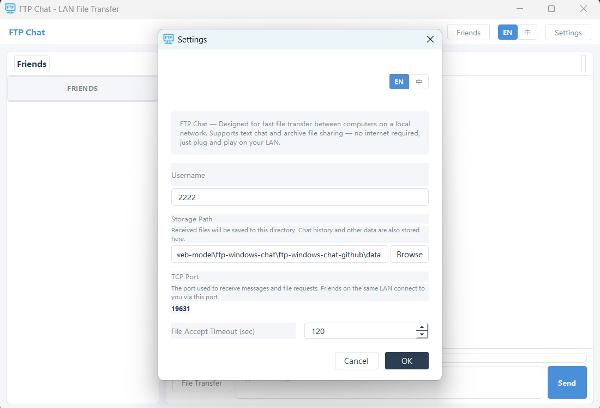

# FTP Chat — LAN One-on-One Chat & File Transfer Tool

<p align="center">
  <strong>Designed for fast file transfer between computers on a local network</strong><br>
  Supports one-on-one text chat and file sharing — no internet required, just plug and play on your LAN
</p>

---

## Features

- **One-on-One Chat** — Direct messaging with local message persistence and delivery status feedback
- **File Transfer** — FTP-based file transfer with large file support, progress indicator, and real-time speed
- **Friend Management** — Add friends on the same LAN by IP address with real-time online status detection; notify the other party when deleting a friend
- **Unread Messages** — Unread count badge for messages from non-active chats
- **Multi-language** — Chinese / English switching
- **Zero Internet Dependency** — Pure LAN communication, no internet connection needed

## Screenshots

### Chat with Friends



### Friend Management



### Settings



## Tech Stack

| Module | Technology |
|--------|-----------|
| GUI Framework | PyQt5 |
| Messaging | TCP Socket (custom protocol) |
| File Transfer | FTP (pyftpdlib) |
| Data Storage | JSON files |
| Language | Python 3.12 |

## Project Structure

```
ftp-windows-chat-github/
├── main.py                       # Application entry point, initializes app and launches main window
├── build.py                      # Build script, uses PyInstaller to generate EXE
├── requirements.txt              # Dependencies
├── config/
│   ├── settings.py               # Global config (ports, paths, timeouts, etc.)
│   ├── theme.py                  # UI theme styles (colors, fonts, button styles)
│   └── i18n/                     # Internationalization
│       ├── __init__.py           # Translation function t(), supports dynamic language switching
│       ├── zh_cn.py              # Chinese translation dictionary
│       └── en_us.py              # English translation dictionary
├── core/
│   ├── network.py                # TCP server/client, online detection with status cache
│   ├── chat_manager.py           # Chat message management, send/receive and event dispatch
│   ├── file_manager.py           # File transfer management, send/receive lifecycle control
│   ├── ftp_server.py             # Temporary FTP server, independent instance per transfer
│   └── ftp_client.py             # FTP download client, progress callback and speed calculation
├── models/
│   ├── friend.py                 # Friend model, CRUD and persistence
│   ├── message.py                # Message model, text/file messages with delivery status
│   └── file_transfer.py          # File transfer record model, status tracking
├── ui/
│   ├── main_window.py            # Main window, event dispatch and heartbeat detection
│   ├── chat_widget.py            # Chat area, message display and input sending
│   ├── friend_list.py            # Friend list component
│   ├── friend_manager_dialog.py  # Friend management dialog (add/delete)
│   ├── add_friend_dialog.py      # Add friend dialog
│   ├── settings_dialog.py        # Settings dialog
│   └── components/
│       ├── message_bubble.py     # Message bubble component (text/file styles)
│       ├── file_receive_dialog.py# File receive confirmation dialog (countdown)
│       └── language_switch.py    # Language switch component
├── utils/
│   ├── helpers.py                # Utility functions (formatting, auto-rename, etc.)
│   └── logger.py                 # Logging module
└── data/                         # Runtime data (auto-generated)
    ├── config.json               # User configuration
    ├── friends.json              # Friend list
    ├── transfers.json            # File transfer records
    ├── messages/                 # Chat messages (stored per friend)
    ├── files/                    # Received files
    └── logs/                     # Log files
```

## Quick Start

### Prerequisites

- Python 3.12
- Conda (recommended) or pip
- Windows OS

### Create Conda Environment

```bash
conda create -n ftp-chat python=3.12
conda activate ftp-chat
```

### Install Dependencies

```bash
pip install -r requirements.txt
```

### Launch Application

```bash
python main.py
```

On first launch, a settings dialog will appear. Enter your username to get started.

### Build as EXE

```bash
python build.py
```

After the build completes, the executable can be found at `dist/FTPChat/FTPChat.exe`.

## Usage Guide

### 1. Add Friends

Click the "Friends" button in the top-right corner. Enter a friend's name and IP address to send a friend request. Once the other party confirms, you become mutual friends. The friend must be on the same local network with the TCP port (default 19631) accessible.

### 2. Send Messages

Select a friend from the list on the left. Type your message in the input area at the bottom, and click "Send" or press **Enter**. Press **Shift+Enter** for a new line.

### 3. Transfer Files

- Click the "File Transfer" button or drag and drop a file into the input area
- The recipient will receive a file transfer request popup and can choose to accept or reject
- A progress bar and real-time speed are displayed during transfer
- Auto-reject on timeout, sender status updates accordingly
- Received files are saved to the configured storage path; duplicate filenames are auto-renamed

### 4. Delete Friends

When deleting a friend in the friend manager, the other party will be notified. They can choose to delete you as well or keep a marker.

### 5. Settings

- **Username**: The name displayed to other users
- **Storage Path**: Directory where received files are saved
- **TCP Port**: The port used to receive messages and file requests (default 19631). Friends on the same LAN connect to you via this port
- **File Accept Timeout**: Auto-timeout for file transfer requests (default 120 seconds)

## How It Works

```
Sending a message:
  Sender → TCP Socket → Receiver:19631 → Parse and display

Transferring a file:
  1. Sender starts a temporary FTP server (random port)
  2. Sender notifies receiver via TCP (file name, size, FTP port)
  3. Receiver confirms, then downloads the file via FTP protocol
  4. After download completes, sender is notified and the temporary FTP server shuts down

Online detection:
  Heartbeat timer checks all friends' online status every 30 seconds via forced TCP connection
  Sending a message automatically updates the cache to avoid redundant checks
```

## Dependencies

- [PyQt5](https://pypi.org/project/PyQt5/) >= 5.15.0 — GUI framework
- [pyftpdlib](https://pypi.org/project/pyftpdlib/) >= 1.5.9 — FTP server

## More IT Learning Resources

More IT learning resources: https://www.3woop.com

## License

MIT License
